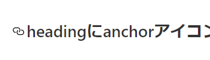

# シェアボタン設置


- [Add social share buttons to use react-share](https://github.com/suzukalight/suzukalight.github.io/commit/abc303d0d7390174717d1ec86a2cbd47be5f9f26)
- https://takumon.com/2018/09/16/

`react-share` ライブラリを使用することで、Facebook, Twitter, Pocketなどへのシェアボタンを配置できます。

はてブへのシェアボタンについては、[はてなブックマークボタン](https://b.hatena.ne.jp/guide/bbutton)サイトを通して、ボタンを生成します。横長ボタンを選択して、スタイルを調整する形が、react-shareと見た目を揃えやすかったです。

# 外部リンクに noopener や _blank を付与する

`gatsby-remark-external-links` を `gatsby-transformer-remark` のプラグイン設定に追加します。これだけで、記事内の外部リンク表現が自動的に処理され、新タブで開いたり、noopener属性をつけたりすることができます；

```javascript{6-10}:title=gatsby-config.js
    {
      resolve: `gatsby-transformer-remark`,
      options: {
        plugins: [
          {
            resolve: 'gatsby-remark-external-links',
            options: {
              target: '_blank',
              rel: 'noopener',
            },
          },
```

# Twitter の投稿を自動展開する

`gatsby-plugin-twitter` プラグインをインストールすると、自動展開してくれるようになります；

```javascript{4}:title=gatsby-config.js
module.exports = {
  plugins: [
    ...,
    `gatsby-plugin-twitter`
  ],
};
```

Twitter で対象の投稿を開き、右上のボタンをクリックして「」を選択すると、埋め込み用の HTML を得ることができます。このうち `blockquote` のタグだけを markdown にコピペすれば、プラグインが自動的にツイートを展開してくれます；

```html
<blockquote class="twitter-tweet" data-dnt="true" align="center">
  <p lang="ja" dir="ltr">
    カオマンガイ美味しすぎる… <a href="https://t.co/3Su9WXz678">pic.twitter.com/3Su9WXz678</a>
  </p>
  &mdash; suzukalight (@suzukalight)
  <a href="https://twitter.com/suzukalight/status/1131785093582807040?ref_src=twsrc%5Etfw">
    May 24, 2019
  </a>
</blockquote>
```

<blockquote class="twitter-tweet" data-dnt="true" align="center"><p lang="ja" dir="ltr">カオマンガイ美味しすぎる… <a href="https://t.co/3Su9WXz678">pic.twitter.com/3Su9WXz678</a></p>&mdash; suzukalight (@suzukalight) <a href="https://twitter.com/suzukalight/status/1131785093582807040?ref_src=twsrc%5Etfw">May 24, 2019</a></blockquote>

注意点として、developモードだとツイートが展開されない場合があります。どうもこのツイート展開は「画面遷移」をトリガにして行っているようなので、いったん別の画面に遷移して、また当該記事に戻ってくれば、ちゃんと展開されていることが確認できます。

# iframely で oEmbed 対応リンクを展開する

- https://iframely.com/embed
- https://takumon.com/iframely

iframelyというサービスを利用すると、oEmbedに対応しているサービスについて、iframe内で表示できるようにしてくれます。（youtubeとかspeakerdeckとか）下記はhatenablogの展開です；

<iframe src="https://hatenablog-parts.com/embed?url=https%3A%2F%2Fdevelopers.relationsgroup.co.jp%2Fentry%2F2018%2F12%2F18%2F120000" style="border: 0; width: 100%; height: 190px;" allowfullscreen scrolling="no" allow="encrypted-media"></iframe>

iframelyを利用するためには、専用のスクリプトを取り込む必要があります。React系の場合は、Helmetを使って読み込むコンポーネントを作成すると良い、と公式で案内されていました；

```javascript:title=components/atoms/Iframely/index.js
import React from 'react';
import Helmet from 'react-helmet';

export default class Iframely extends React.Component {
  componentDidMount() {
    // 記事ページから古い記事に遷移したときにもロードされるようにする
    if (window.iframely) {
      window.iframely.load();
    }
  }

  render() {
    // マークダウンファイルにembed.jsのスクリプトタグを記述しても読み込まれないため
    // コンポーネントでReact Helmetを使って読み込む
    return (
      <Helmet>
        <script type="text/javascript" src="https://cdn.iframe.ly/embed.js" charset="utf-8" />
      </Helmet>
    );
  }
}
```

```javascript{4}:title=BlogPost.js
  return (
    <Layout location={location} title={siteTitle}>
      <Seo title={title} description={description} />
      <Iframely />
```

埋め込む用のリンクは、 https://iframely.com/embed にて生成します。ここで生成したリンクはReact系には対応していないため、下記の2つの操作が必要になります；

1. data-iframely-urlの末尾に `&omit_script=1` `&iframe=1` を追加
2. embed.jsの読み込みを削除

下記は一般的なWebサイトのURLから、（おそらく）OGPデータを取得した結果です；

```html
<div class="iframely-embed">
  <div class="iframely-responsive" style="height: 140px; padding-bottom: 0;">
    <a href="https://suzukalight.com/" data-iframely-url="//cdn.iframe.ly/NmXUI7w?omit_script=1&iframe=1"></a>
  </div>
</div>
```

<div class="iframely-embed"><div class="iframely-responsive" style="height: 140px; padding-bottom: 0;"><a href="https://suzukalight.com/" data-iframely-url="//cdn.iframe.ly/NmXUI7w?omit_script=1&iframe=1"></a></div></div>

以上のように、設定に少しクセはありますが、動画コンテンツやライブデモなどを提供できるようになりますので、設置して見る価値はあると思います。

# headingにanchorアイコンを付与



- [Add gatsby-remark-code-titles](https://github.com/suzukalight/suzukalight.github.io/commit/410289641fb4da6aa9f5e107f2b8b243a6154f16)

Heading要素にアンカーリンクを付与し、鎖マークで取得できるようにします。鎖マークはHeading要素をホバーすると出てくる形です。

`gatsby-remark-autolink-headers` を追加すると、Markdownのheading要素に対して、鎖マークを付与し、アンカーリンクを提供できるようになります。


```javascript{6-11}:title=gatsby-config.js
      resolve: `gatsby-transformer-remark`,
      options: {
        plugins: [
          ...,
          {
            resolve: `gatsby-remark-autolink-headers`,
            options: {
              offsetY: `100`,
              icon: `<svg aria-hidden="true" height="20" version="1.1" viewBox="0 0 16 16" width="20"><path fill-rule="evenodd" d="M4 9h1v1H4c-1.5 0-3-1.69-3-3.5S2.55 3 4 3h4c1.45 0 3 1.69 3 3.5 0 1.41-.91 2.72-2 3.25V8.59c.58-.45 1-1.27 1-2.09C10 5.22 8.98 4 8 4H4c-.98 0-2 1.22-2 2.5S3 9 4 9zm9-3h-1v1h1c1 0 2 1.22 2 2.5S13.98 12 13 12H9c-.98 0-2-1.22-2-2.5 0-.83.42-1.64 1-2.09V6.25c-1.09.53-2 1.84-2 3.25C6 11.31 7.55 13 9 13h4c1.45 0 3-1.69 3-3.5S14.5 6 13 6z"></path></svg>`,
              className: `gatsby-autolink-headers`,
            },
          },
```
