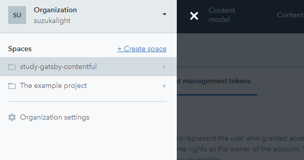
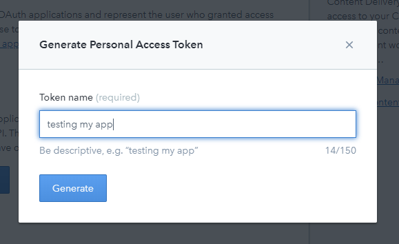
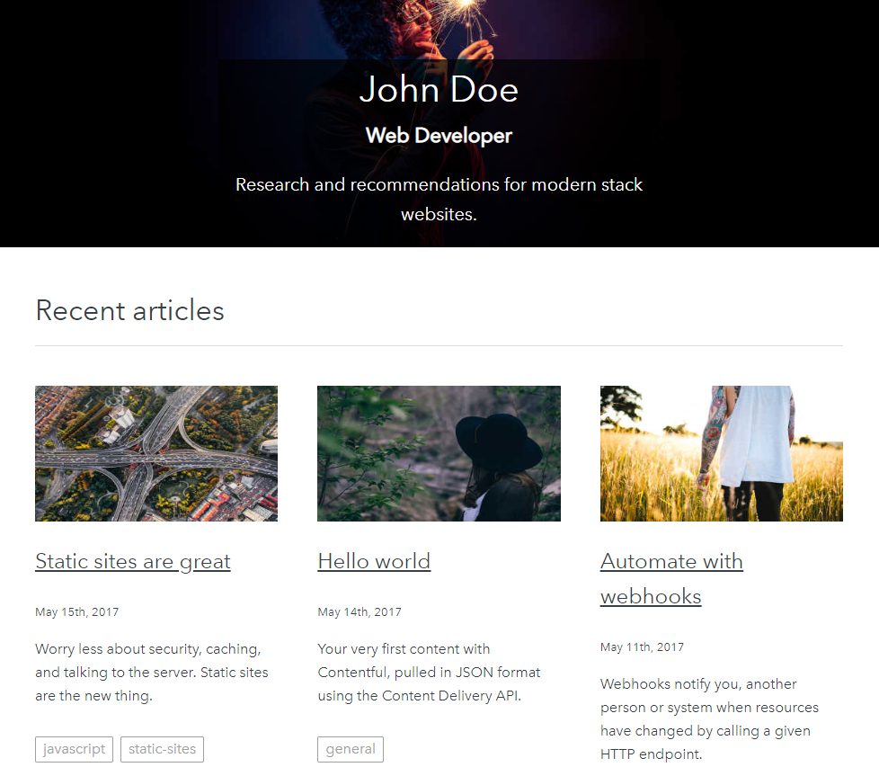
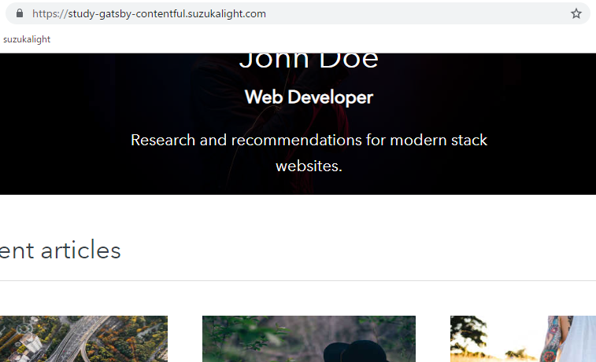

[Contentful](https://www.contentful.com/) は Headless-CMS と呼ばれる仕組みを提供しており、コンテンツの設計と配信（API）のみを受け持つようなサービスになっています。WordPressとの違いは、コンテンツ表示までは担当していないところです。

Gatsby でこれを利用することで、コンテンツはSaaS側に載せて管理しておき、WebシステムはReact系で作成する、ということができるようになります。

これにより、サイト管理はGitが使えない一般の人にもできて、開発はReact、配信はJAMstackでできるという、フロントエンドエンジニアにとって夢の環境が実現できます（単にWordPressを触りたくないだけとも言う）

早速、ContentfulでGatsbyを素振りしてみました。公式のこれにしたがって、Webサイトを1つ作ってみます；

<div class="iframely-embed"><div class="iframely-responsive" style="height: 140px; padding-bottom: 0;"><a href="https://www.contentful.com/r/knowledgebase/gatsbyjs-and-contentful-in-five-minutes/" data-iframely-url="//cdn.iframe.ly/RRJvt0D?omit_script=1&iframe=card-small"></a></div></div>

# gatsby-contentful-starter

公式のstarterをもとに、リポジトリをセットアップします；

```bash
gatsby new study-gatsby-contentful https://github.com/contentful-userland/gatsby-contentful-starter
```

# Contentful のセットアップ

## サインアップ

まずサインアップ。GitHub Pagesにデプロイするので、そのアカウントで登録するほうが、後々楽になるかと；

<div class="iframely-embed"><div class="iframely-responsive" style="height: 140px; padding-bottom: 0;"><a href="https://www.contentful.com/sign-up/" data-iframely-url="//cdn.iframe.ly/0Tl8u8R?iframe=card-small"></a></div></div>

利用目的を聞かれる（サンプルのSpaceを1つ用意してくれる）ので、左側のWebAppを選択しました。このサンプルは使用しない予定ですが、Webサイトのコンテンツ例として非常に良くできているので、今後の参考になりました。

## Space の作成

無料枠では2つのSpaceを作成できるので、2つ目の枠でハンズオンしてみます。ドロワーから `+ Create space` を選択；



Free枠を選択し、適当なスペース名（ここでは study-gatsby-contentful とした）を入力して完了。

## tokens の作成

Contentful でWebサイトを作成するには、下記3つのトークンが必要のようです。それぞれ作成していきます；

- Content Management Token
- Content Delivery Token
- Content Preview Token

### Content management tokens

`Settings->APIs` から `Content management tokens` を選択して、 `Generate personal token` を作成；


どういう利用法のトークンなのかを訊かれるので、適当に説明；



API Tokenは1回しか表示できないので、必ずコピーしておき、適切に保管しておきます。

### Content delivery / preview tokens

つづけて `Delivery token` と `Preview Token` を作成。`Settings->APIs` の `Content delivery / preview tokens` を選択し、 `Add API key` をクリックすれば作成完了。

# gatsby-contentful-starter の設定

作成したトークンを starter に設定します。`yarn setup` コマンドがあり、自動設定してくれるようになっています；

```bash
$ yarn setup

$ Your Space ID
$ Your Content Management API access token
$ Your Content Delivery API access token

...

The import took a few seconds (27s)
No errors or warnings occurred
The import was successful.
All set! You can now run yarn run dev to see it in action.

Done in 109.99s.
```

このとき、Contentful のコンテンツをもとに、Webサイトのビルドも合わせて行ってくれるため、この時点ですでに手元でSSGされている状態になります。

なお、設定したトークンの情報は、 `.env.development` などのファイルに書き出されます。このファイルは `.gitignore` されているため、リポジトリにプッシュしても漏洩の心配はなさそうです。

# 開発用ビルド

```bash
$ yarn dev

...

DONE  Compiled successfully in 2670ms   
You can now view gatsby-contentful-starter in the browser.⠀
  http://localhost:8000/
```

あっという間に完成です。



> __Static Sites are great!__

おっしゃる通り。

# コンテンツの書き換え

試しにContentfulのContentsを書き換えてみましょう。`Content` から適当に1つ（たとえば一番上の記事）を選択して、Markdownを書き加えてみます；


そして `Publish changes` をして、 `yarn develop` をし直せば…書き換わっています！


> さすがにContentfulを書き換えたら、自動的にプレビュー側も更新されている…ということはありませんでしたが、あるいはwebhooksとかで設定できれば、できるかもしれない…？

> ちなみに、developで取得したコンテンツは、Previewトークンを利用しているので、Unpublishedなコンテンツも引っ張れるようになっているようです。

# デプロイ

## GitHub Pages 向けの設定

デフォルトのURL設定から、GitHub Pages向けの設定に変更しておきます。具体的には `pathPrefix` を除去し、独自のサブドメインをセットしました；

```javascript{4-5}:title=gatsby-config.js
module.exports = {
  siteMetadata: {
    title: 'Gatsby Contentful starter',
    siteUrl: `https://study-gatsby-contentful.suzukalight.com`,
  },
  plugins: [
```

サブドメインを利用する場合は、DNS側でサブドメインを作成した後、CNAMEレコードを向けておきます。

## GitHub Pages へのデプロイ

ほかのstarterと同様、下記のコマンドが利用できました；

- `yarn build` : 本番ビルド
- `yarn deploy` : GitHub Pages への公開

```bash
$ yarn deploy

...

info Done building in 15.659 sec

Published
Done in 27.92s.
```

GitHub Pages でホスティングできました、これで完了です！


