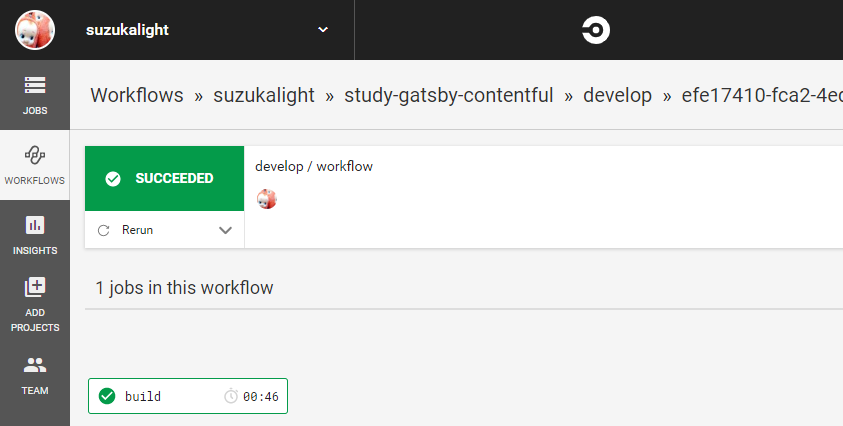
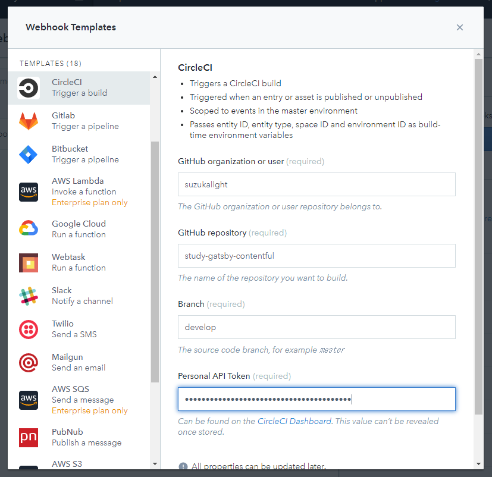
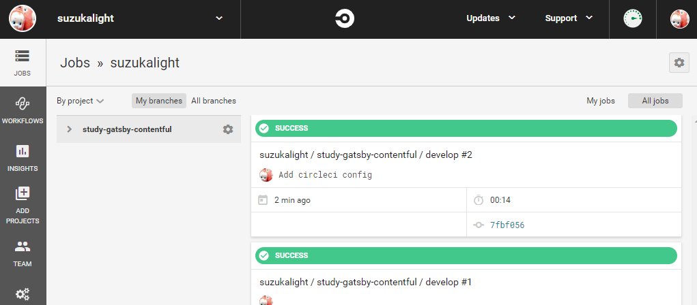
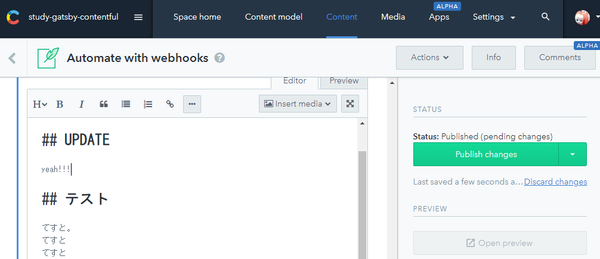
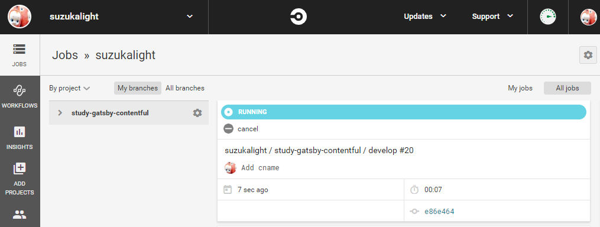

GitHub に CircleCI を設置しておき、Contentful の webhook 機能から記事の更新をトリガして、CI による GitHub Pages への自動デプロイができるようにする方法を紹介します。

<div class="iframely-embed"><div class="iframely-responsive" style="height: 140px; padding-bottom: 0;"><a href="https://suzukalight.com/2019-07-13-contentful-starter/" data-iframely-url="//cdn.iframe.ly/JcHxZbj?omit_script=1&iframe=card-small"></a></div></div>

前回、Contentful による Gatsby サイトのハンズオンを行いました。しかしながらこのままだと Contentful で記事を更新しても、コンテンツサーバ側は更新できません。Gatsby に SSG してもらい、それをサーバにデプロイする必要があります。

Contenful には webhook 機能があり、記事の更新時などにトリガさせることができます。この webhook によって CircleCI を起動させ、CircleCI に `yarn deploy` を行わせることで、自動的に GitHub Pages へデプロイすることを狙いとしています。

# CircleCI の設置と動作確認

## サインアップ

https://circleci.com/signup/

- GitHubアカウントでサインアップ
- `Follow a Project` -> study-gatsby-contentful

## ブログリポジトリにCI設定

- study-gatsby-contentful を `Set Up Project`
- config.yml のテンプレートをコピー

## リポジトリのファイルを更新

- `.circleci/config.yml` として、上のテンプレートを保存
- `package.json` の `test` を `yarn lint` に変更（動作確認用）

```javascript{3}:title=package.json
{
  "scripts": {
    "test": "yarn lint",
  }
}
```

- 上記2つの変更についてコミット

## CIの動作確認

- `Start building` で開始！
- テストが成功したかを確認



## Personal API Token を入手

- User -> Personal API Tokens -> `Create New Token`
    - 適当な名前（Contentfulなど）を入力し、APIトークンを生成

# Contentful の初期設定

## Contentful に webhook を追加

- `Settings -> Webhooks`
    - 右側の Webhook templates から `CircleCI` を `Add`
    - 必要な情報を入力して、 `Create webhook`



## コンテンツを変更し、CIが起動するかチェック

適当なコンテンツを変更してみて、Webhookが起動し、CircleCIのテストが走るかを確認；



# デプロイまでの詳細設定

## CircleCI

### SSH Key

CircleCIがデプロイに使用するためのSSH鍵を新規に生成します；

```bash:title=bash
$ ssh-keygen -t rsa -b 4096 -C "circleci@suzukalight.com" -f ~/.ssh/circleci-suzukalight
$ pbcopy < ~/.ssh/circleci-suzukalight
```

__Settings -> SSH Permisions -> Add SSH Key__ に秘密鍵をCircleCIに登録し、そのfingerprintを保存しておきます；

```
Hostname    : github.com  
Private Key : [Paste Clipboard]
```

### Environment Variables

__Settings -> Environment Variables__ に Contentful の AccessToken と SpaceID を登録しておき、CircleCI からデプロイができるようにします。

```
CONTENTFUL_ACCESS_TOKEN : xxx
CONTENTFUL_SPACE_ID     : xxx
HOST_NAME               : github.com
USER_NAME               : circleci
```

## GitHub

### Deploy Key

__Settings -> Deploy keys -> Add Deploy Key__ に、先程の秘密鍵に対する公開鍵を GitHub 側に登録します；

```bash:title=bash
$ pbcopy < ~/.ssh/circleci-suzukalight.pub
```

```
Title : CircleCI-Contentful
Key   : [Paste Clipboard]
[x]   : Allow write access
```

## gatsby-contentful-starter

CircleCI で実行するデプロイコマンドを追加します。CircleCI に秘密鍵を登録したときに表示された fingerprint を用意しておきましょう；

### config.yml

```yml:title=.circleci/config.yml
      # run deploy
      - add_ssh_keys:  
          fingerprints:  
            - "aa:aa:aa:aa..."  

      - run:  
          name: Start ssh-keyscan  
          command: |  
            ssh-keyscan ${HOST_NAME} >> ~/.ssh/known_hosts

      - run:
          name: Deploy development branch to gh-pages
          command: |
            git config user.email "circleci@suzukalight.com"
            git config user.name "circleci"
            yarn deploy
```

### static/CNAME

独自ドメインを登録している人は、CNAMEファイルを忘れずに追加しましょう。私はこれを忘れていて、デプロイのたびにリセットされてしまいました。

```text:title=static/CNAME
study-gatsby-contentful.suzukalight.com
```

# 記事を更新してみよう

これでセットアップは完了です。では早速、Contentful で記事を更新してみます。



CircleCI 側の job を見ると、即座に実行が開始されており、30秒ほどでデプロイ完了のSUCCESS表示に切り替わります。



記事側を見にいくと、更新されていることが確認できます。これで完了です！


