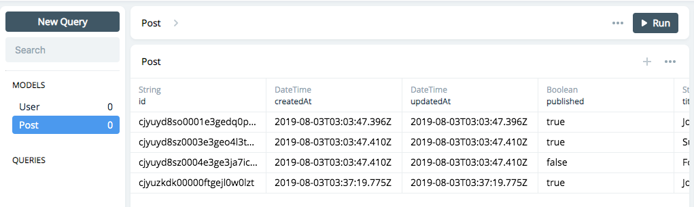

# Prisma2

- Prisma2: https://github.com/prisma/prisma2


（※上記リポジトリより引用）

prisma2 ecosystem には、下記の3つが含まれています；

- __PhotonJS__: ORM。自作のサーバにimportして利用するライブラリ
- __Lift__: データモデリングとマイグレーションを行う、CLIツール
- __Studio__: データ管理画面を提供する、GUIツール

v1では専用サーバを立ち上げて、間接的にprismaを利用する形式でしたが、v2では自作サーバに Photon をimportすることで、直接データを触っていくスタイルに変更されました。

Lift や Studio は、prisma2 CLI をインストールすることで利用することができるようになります。

# セットアップ

- [prisma2/tutorial\.md at master · prisma/prisma2](https://github.com/prisma/prisma2/blob/master/docs/tutorial.md)

上記ドキュメントの手順で進めていきます。ここではお手軽に SQLite を使ってハンズオンをしてみます。

## インストール

1. prisma2 CLI をインストール
1. prisma2 init でボイラープレートを作成

```bash
$ npm i -g prisma2
$ prisma2 init study-prisma2

> > SQLite

> [x] Photon
> [x] Lift
> > Create

> > TypeScript

> > From Scratch

> Your template has been successfully set up!
```

## VSCodeにエクステンションを追加

あったほうが開発がはかどります；

- __[SQLite](https://marketplace.visualstudio.com/items?itemName=alexcvzz.vscode-sqlite)__ : dev.db の中身を表示できる
- __[Prisma](https://marketplace.visualstudio.com/items?itemName=Prisma.prisma)__: .prisma などのシンタックスハイライトができる

# 実行

## マイグレーション・シーダー

1. Lift を使ってマイグレーション
1. ボイラープレート付属の seeder スクリプトを使って、UserとPostを作成

```bash
$ cd study-prisma2
$ yarn

$ prisma2 lift up

> Done with 1 migration in 196ms.

$ yarn seed

> Done in 1.52s.
```

SQLiteエクステンションで開いてみると、seederによってPostが増えているのが確認できました；


## サンプルスクリプトの実行

サンプルスクリプト `src/script.ts` は、PhotonJSを使って、下記の処理を実行するサンプルです；

- すべての公開済みPostを取得
- User:alice が新しいPostを作成＋公開
- User:alice のPost一覧を取得

実行結果は console.log で出力されます（一部省略）；

```bash
$ yarn start

> $ ts-node src/script.ts
> Retrieved all published posts: ...
> Created a new post: ...
> Published the newly created post: ...
> Retrieved all posts from a specific user: ...

> ✨  Done in 1.59s.
```

SQLiteエクステンションで開いてみると、サンプルスクリプトによってPostが増えているのが確認できました；


# Studioの起動

DBの状態は、管理ツールであるStudioを起動することでも操作が可能です。prisma2 の Development mode を起動して、Studioを利用可能にしましょう；

```bash
$ prisma2 dev
```

管理ツールは http://localhost:5555 で起動します。ここからデータの閲覧や、クエリの発行などが可能になります；



# あとがき

ハンズオンはあっという間に完了することができました。次は自前のGraphQLサーバを作成しつつ、適当なSPAクライアントを実装して見る予定です。

# References

- [Prisma2](https://github.com/prisma/prisma2)
- [prisma2/tutorial\.md at master · prisma/prisma2](https://github.com/prisma/prisma2/blob/master/docs/tutorial.md)
- [Prisma 2 Preview: Type-safe Database Access & Declarative Migrations](https://www.prisma.io/blog/announcing-prisma-2-zq1s745db8i5#getting-started-with-prisma-2)
