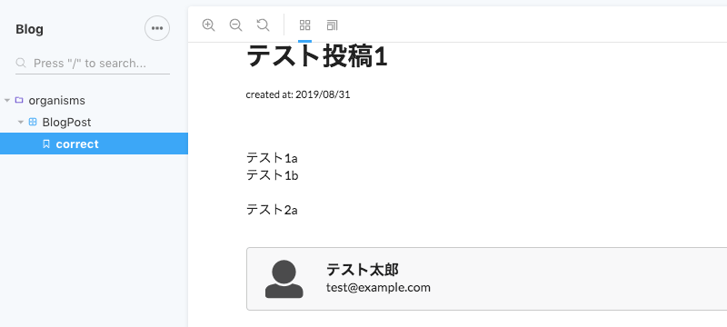
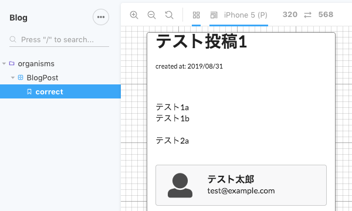
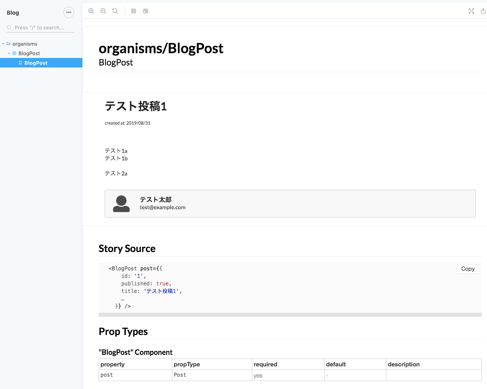

monorepo 環境で、create-react-app w/ TypeScript したパッケージのコンポーネントカタログを Storybook で表示し、さらにその型情報も表示させる設定例です。

# 前提条件

## 動作環境

- Mac
- Node.js v10.16.0 / npm v6.9.0
- create-react-app (react-script v3.1.1)
- TypeScript v3.5.3
- Storybook v5.1
- @storybook/addon-viewport
- react-docgen-typescript-loader

# Storybook 本体のセットアップ

## yarn install

- Storybook w/React, Addons(viewport) をインストール
- 型情報もインストール

```bash
$ yarn workspace client add -D @storybook/react @storybook/theming @storybook/addons @storybook/addon-viewport @types/storybook__react @types/storybook__addon-actions
```

## config

### ./.storybook/config.js

子パッケージの `./.storybook/config.js` に設定を記述します。

- `/.stories.tsx?$/` にマッチするファイルすべてを対象にするように設定
- Storybook のテーマを設定

```javascript:title=src/client/.storybook/config.js
import { configure, addParameters } from '@storybook/react';
import { create } from '@storybook/theming';

addParameters({
  options: {
    theme: create({
      base: 'light',
      brandTitle: 'Blog',
    }),
  },
});

// automatically import all files ending in *.stories.js
const req = require.context('../src/components', true, /.stories.tsx?$/);
function loadStories() {
  req.keys().forEach(filename => req(filename));
}

configure(loadStories, module);
```

### ./.storybook/addons.js

viewport のアドオンを追加します；

```javascript:title=src/client/.storybook/addons.js
import '@storybook/addon-viewport/register';
```

## React Component を記述

コンポーネント記述に使用する、各種のライブラリをインストールします；

- `node-sass`: CSS Modules に SASS を使用
- `semantic-ui-react`, `semantic-ui-css`: CSS フレームワーク
- `date-fns`: 日付管理ライブラリ

```bash
$ yarn workspace client add node-sass semantic-ui-react semantic-ui-css date-fns
```

### コンポーネント

```javascript:title=src/client/src/components/organisms/RaceListSmall/index.tsx
import React from 'react';
import format from 'date-fns/format';
import { Container, Header, Message, Icon } from 'semantic-ui-react';

import { User, Post } from '../../../types/data';

import styles from './index.module.scss';

interface AuthorPresenterProps {
  author: User | null;
}

export const Author = ({ author }: AuthorPresenterProps) =>
  author && (
    <Message icon>
      <Icon name="user" size="large" />
      <Message.Content>
        <Message.Header>{author.name}</Message.Header>
        {author.email}
      </Message.Content>
    </Message>
  );

export interface BlogPostPresenterProps {
  post: Post;
}

export const BlogPost = ({ post }: BlogPostPresenterProps) => (
  <Container>
    <Header as="h1">{post.title}</Header>
    <small>{`created at: ${format(post.createdAt, 'yyyy/MM/dd')}`}</small>
    <article className={styles.content}>{post.content}</article>
    <Author author={post.author} />
  </Container>
);

export default BlogPost;
```

### スタイル

```scss:title=src/client/src/components/organisms/BlogPost/index.module.scss
.content {
  margin: 32px 0;
  white-space: pre-wrap;
}
```

### Storybook

```javascript:title=src/client/src/components/organisms/RaceListSmall/storybook/index.stories.tsx
import React from 'react';
import { storiesOf } from '@storybook/react';

import { Post } from '../../../../types/data';

import BlogPost from '..';

const post: Post = {
  id: '1',
  published: true,
  title: 'テスト投稿1',
  createdAt: new Date(2019, 7, 31, 18, 0, 0),
  updatedAt: new Date(2019, 7, 31, 18, 0, 0),
  author: {
    id: '1',
    name: 'テスト太郎',
    email: 'test@example.com',
  },
  content: `
テスト1a
テスト1b

テスト2a`,
};

storiesOf('organisms/BlogPost', module).add('BlogPost', () => <BlogPost post={post} />);
```

## yarn storybook で起動

`yarn workspace [ws-name] [command]` 構文を使って package.json に Storybook の起動コマンドを書いておきます。これで `yarn storybook` というシンプルなコマンドで、Storybook を実行可能になります；

```json:title=package.json
{
  "scripts": {
    "storybook": "yarn workspace client start-storybook"
  }
}
```

```bash
$ yarn storybook
```

Storybook が起動し、以下のようなコンポーネントのカタログが表示されれば、セットアップは完了です；



Viewport アドオンを有効化しましたので、下記のように iPhone 表示なども試すことができます；



# TypeScript DocGen アドオン

## yarn install

```bash
$ yarn workspace client add -D @storybook/addon-info react-docgen-typescript-loader
```

## webpack.config.js

Storybook 用のカスタム Config を作成します；

```json:title=src/client/.storybook/webpack.config.js
module.exports = ({ config }) => {
  config.module.rules.push({
    test: /\.(ts|tsx)$/,
    use: [
      {
        loader: require.resolve('react-docgen-typescript-loader'),
      },
    ],
  });
  config.resolve.extensions.push('.ts', '.tsx');
  return config;
};
```

## index.stories.jsx

Story で withInfo をすることで、コンポーネントに関する情報を表示させることができるようになります。このなかに「Prop Types」ブロックがあるのですが、ここが react-docgen-typescript-loader によって拡張され、TypeScript で指定した型情報が表示されるようになります；

```javascript{3,28-29}:title=src/client/src/components/organisms/BlogPost/__stories__/index.stories.tsx
import React from 'react';
import { storiesOf } from '@storybook/react';
import { withInfo } from '@storybook/addon-info';

import { Post } from '../../../../types/data';

import BlogPost from '..';

const post: Post = {
  id: '1',
  published: true,
  title: 'テスト投稿1',
  createdAt: new Date(2019, 7, 31, 18, 0, 0),
  updatedAt: new Date(2019, 7, 31, 18, 0, 0),
  author: {
    id: '1',
    name: 'テスト太郎',
    email: 'test@example.com',
  },
  content: `
テスト1a
テスト1b

テスト2a`,
};

storiesOf('organisms/BlogPost', module)
  .addDecorator(withInfo({ inline: true }))
  .add('BlogPost', () => <BlogPost post={post} />);
```

## 型情報の表示

上記のように Storybook を更新すると、以下のようなコンポーネント情報が表示され、PropTypes 部分に TypeScript で記述した型情報が表示されていれば、今回の目標は達成です！


