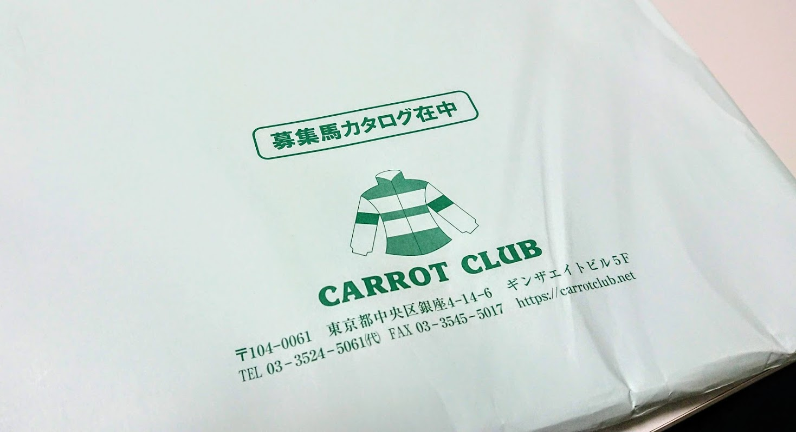
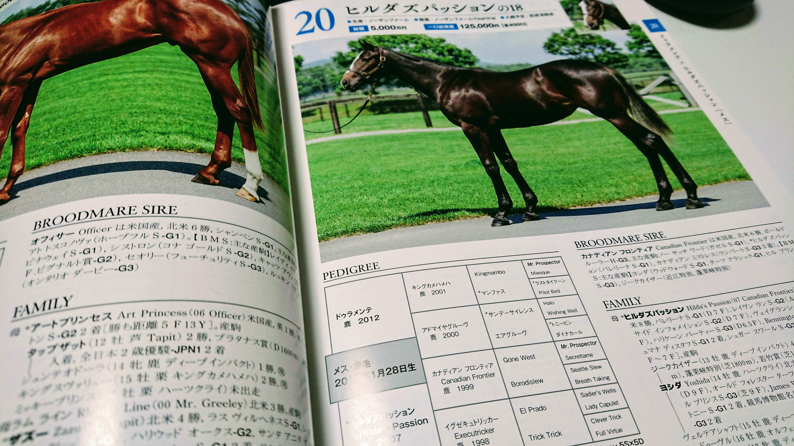
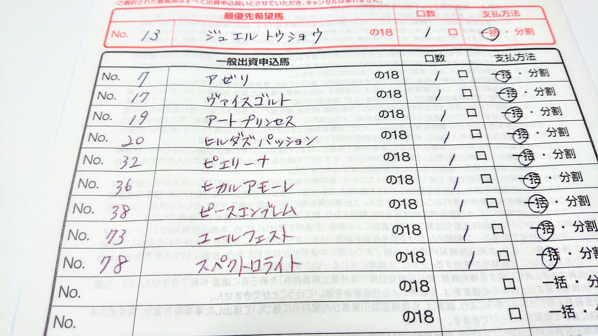
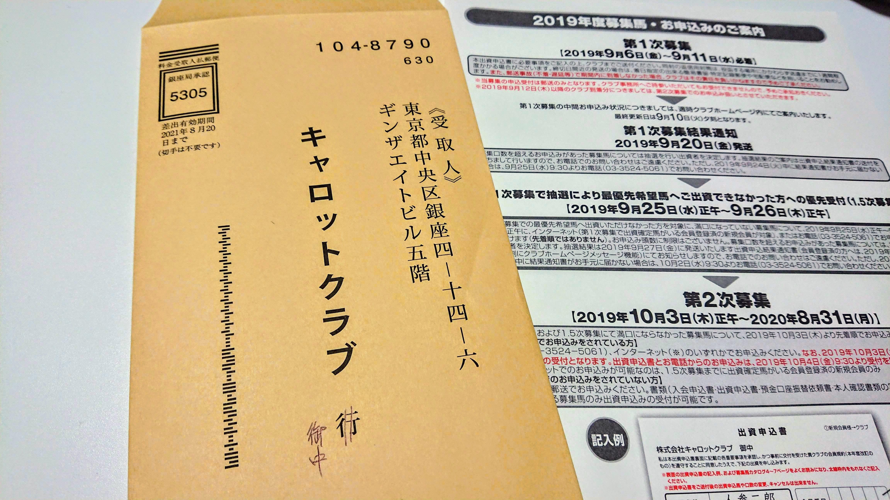

~~ねんがんのサラブレッドをてにいれたぞ~~

**競馬ファンなら一度は憧れる夢・馬主になる**。今年はこれを達成するために、キャロットクラブで一口馬主に入会してみます。新規入会者の壁が非常に高いと評判ではありますが、果たして結果はいかに？

# はじめに

## キャロットクラブとは

https://carrotclub.net/

**サートゥルナーリア、リスグラシュー、レイデオロなど、有名馬が多数在籍する、言わずとしれた一口馬主クラブ**。私もいつかは馬主になりたいという夢を持っていましたが、今年ついに申し込むことにしました！

# 出資のシステム

## 最優先枠

キャロットクラブはすでに多数の一口馬主会員が存在し、会員内で馬の取り合い、つまり抽選が起きているような状態です。

そういった状態ですから、キャロットクラブでは「**最優先枠**」を 1 つ行使できるシステムがあり、その枠で申し込んだ馬については、**他の会員より優先して抽選される**ようになっています。

しかし、この最優先枠ですら申し込み叶わず、×1、×2 という救済制度まで出てきている状態だそうで…。

結果として優先度序列が細分化していき、**現在の序列としては「×2」「×1」「最優先」「一般」の 4 順位が存在する**、なんてことになっているそうです。

## 母馬優先枠

もうひとつ、キャロットクラブの特徴的な抽選システムとして「**母馬優先**」という制度があります。これは当該馬の母馬に投資していた人に、400 口のうちの半分、**200 口が優先抽選枠として確保される**というシステムです。

OurBlood というスローガンに基づき、親子末代まで馬主として応援していくことをサポートする、面白いシステムですね。個人的に好きなシステムです。はやく会員になりたい。

ちなみにここにも「×2」「×1」「最優先」があります。つまりすでに優先順位が 8 つも存在することに。

## 新規入会者枠

さて、では我々新規入会者の枠はどうなっているかというと、**この 8 つのさらに下、9 番目になります。非常に厳しい。。。**

# 攻略の糸口

## どういう馬に応募する？

**新規入会者としては、既存会員で満口にならなかった馬を狙って応募する必要があります。**

[こちらのサイト](https://ameblo.jp/gurigurikun1/entry-12404709115.html)によると、2018 年度の満口率は 77.1%だそうです（83 頭中 64 頭が満口）。その前の 2017 年が約 70%。新規会員の抽選権は、既存会員をすべて抽選しつくしたあとからですから、**新規入会者はまず、残りの 23%ないし 30%程度を探さなければ、入会すらできません。**

残る馬の傾向としては「ディープインパクト産駒のような、15 万円を超える高額馬」あるいは「過去実績の薄い、5 万円以下の馬」になるようです。

さすがに 15 万円以上の馬で、23%の壁を超えるために、5 頭も申し込むようなギャンブルは打ちづらいですね。**100 万円くださいとか言われても困る。**

なので、「**過去実績の薄い、5 万円以下の馬**」から 23%側の馬を探しておく必要があります。人気の多寡については、今回は [netkeiba さんの一口馬主サイト](https://owner.netkeiba.com/?rf=navi)から[募集馬の検討リストに入っている数](https://owner.netkeiba.com/?rf=navi)を参考にすることとしました。

ほかに良好なファクターとしては、下記があるかと思います。私が既存会員だったとして、これらの馬は避ける傾向を示すと思うので、その逆張りはチャンスが生まれると思います；

- 厩舎の実績が乏しい、または新規開業
- 母馬が高齢、または初仔
- 種牡馬に実績がない、または新種牡馬
- 管囲が細い、繋ぎの角度が急、歩様が明らかにおかしい

## どれくらい応募する？

もともと人気のない馬を中心に選んでいますから、おそらく 50%くらいは満口にならないのではと想定しました。そうすると、**この枠で 5,6 頭とっておけば、最低でも 1 頭、平均して 3 頭ほどは取れる計算です**。

本当はギリギリまで粘れば、この 50%もより精度が上げられるのでしょうが、新規入会者はそれもかないません（既存会員より期日が 1 日早く、さらに郵送必着のため）。リスク管理のために、やや多めに取っていきます。**たくさん取れたら取れたぶん楽しみが増えるだけ！（なお出費もたくさん）**

# 申込みまで

## 2019-8-18: 申込書取り寄せ

https://carrotclub.net/club/lfx-doc-key-bosyu.htm

キャロットクラブの新規会員募集ページから、フォームに必要事項を記入して申し込みます。1 週間かからずに、申込書とカタログが届きました。オラワクワクすっぞ！

## 2019-8-26: PDF と動画公開

https://carrotclub.net/topics/news_dis_text.asp?No=2263

新規会員には DVD が届きませんので、募集馬の動きを確認するには、オフィシャルサイトへの動画掲載を待つ必要があります。キャロットクラブでは募集開始の少し後に、全馬掲載と相成りました。穴が開くまで観ましょう。

## 2019-9-3: 申し込み馬絞り込み

（※申し込みたくても申し込めないヒルダズパッションの 18）

**今回の大前提は「とにかく入会する」です**。そのうえでリスク管理のために「高い馬一頭ではなく安めの馬を数頭を持つ」こと、「母馬優先のために牝馬を多めに取る」ことを、サブの目標としました。

「比較的人気のない、5 万円以下の馬」をリストアップしていきます。今回はその基準として、**募集開始前の時点で、検討リスト数が 200 未満の馬を対象としました**。

たとえば私が芦毛枠で申し込んだ [ピエリーナの 18](https://owner.netkeiba.com/?pid=horse_profile&id=2018105544) の検討リスト数は 126 件（9/4 時点）ですから、これは対象になる、という感じです。

この作業を繰り返して、スプレッドシートに転記し、その中から自分の気に入った馬を選定していく、という感じです。いろんな仔馬を見てると、どれも目移りするから不思議！

## 2019-9-4: 申込用紙記入

最終的に、申込み用紙に記入したのは、下記の 10 頭でした；

| 属 #  | 馬名                        | 性   | 出資 | 検討 |
| ----- | --------------------------- | ---- | ---- | ---- |
| 東 7  | アゼリの 18                 | メス | 90k  | 258  |
| 東 13 | (優)ジュエルトウショウの 18 | メス | 35k  | 192  |
| 東 17 | ヴァイスゴルトの 18         | 牡   | 60k  | 158  |
| 東 19 | アートプリンセスの 18       | 牡   | 90k  | 303  |
| 東 20 | ヒルダズパッションの 18     | メス | 125k | 444  |
| 東 32 | ピエリーナの 18             | 牡   | 45k  | 126  |
| 東 36 | ヒカルアモーレの 18         | 牡   | 90k  | 293  |
| 東 38 | ピースエンブレムの 18       | メス | 45k  | 181  |
| 西 73 | ユールフェストの 18         | メス | 45k  | 163  |
| 西 78 | スペクトロライトの 18       | メス | 30k  | 200  |

キャロットクラブの特徴である、母馬優先制度を将来に見越して、牝馬へ多めに応募しています。あとは個人的な趣味（関東在住、栗毛や芦毛が好き、ドゥラメンテ産駒が好き）で入れている感じですね。**一口馬主ですから好きと思った馬に応募したい。**

netkeiba の検討リストで、一次募集開始前の時点で 200pts. 以上の馬については、もうすでに厳しいでしょうから、これらは記念応募みたいな感じです。現実としては下記の 5 頭が中心となり、そのうち 23%の壁を突破できるのが 3 頭ほどと読んでいます；

| 属 #  | 馬名                        | 性   | 出資 | 検討 |
| ----- | --------------------------- | ---- | ---- | ---- |
| 東 13 | (優)ジュエルトウショウの 18 | メス | 35k  | 192  |
| 東 17 | ヴァイスゴルトの 18         | 牡   | 60k  | 158  |
| 東 32 | ピエリーナの 18             | 牡   | 45k  | 126  |
| 東 38 | ピースエンブレムの 18       | メス | 45k  | 181  |
| 西 73 | ユールフェストの 18         | メス | 45k  | 163  |

## 2019-9-5: 投函

一次募集開始が 9/6 なので、早ければその日に、遅くても末日までには届くよう、9/5 に投函しました。**私は返信用封筒が翌日配送にならないとは知らず、シルクホースクラブ宛へ前日に投函して見事に失敗した経歴を持っていますので、同じ轍を踏まない（ツラい）**。

もし締め切りギリギリに応募することになる場合は、必ず自費で切手を買い、**できれば大きな郵便局の窓口で、必着日までに届くのを確認されることをオススメします！！！**（まさか同じ赤坂局内で翌日に届かないとは思ってなかった…）

# 結果発表

## 2019-9-9: 中間発表 1 回目

https://carrotclub.net/topics/lfx-news_dis_text-No-1978.htm

9/9(月)、1 回目の中間発表がありました。**28 頭が満口の半数以上応募**があったそうです。

現時点で昨年対比 24%の応募とのことで、最終的にこの 4 ～ 5 倍の応募が見込まれることから、**この時点で名前が挙がっている馬へ、新規入会者が出資できる確率はほぼゼロです。**

私の応募した馬は、4 頭が該当しており、残りは 6 頭となりました。

| 属 #  | 馬名                            | 申込 | 検討    |
| ----- | ------------------------------- | ---- | ------- |
| 東 7  | アゼリの 18                     | -    | 258     |
| 東 13 | ~~(優)ジュエルトウショウの 18~~ | 215  | **192** |
| 東 17 | ヴァイスゴルトの 18             | -    | **158** |
| 東 19 | アートプリンセスの 18           | -    | 303     |
| 東 20 | ~~ヒルダズパッションの 18~~     | 333  | 444     |
| 東 32 | ピエリーナの 18                 | -    | **126** |
| 東 36 | ~~ヒカルアモーレの 18~~         | 201  | 293     |
| 東 38 | ピースエンブレムの 18           | -    | **181** |
| 西 73 | ユールフェストの 18             | -    | **163** |
| 西 78 | ~~スペクトロライトの 18~~       | 300  | 200     |

**最優先消えた！！！**

記念応募だった 5 頭については 3 頭が消えましたが、ドゥラメンテ産駒のアートプリンセスの 18 がまだ残っていますね。ワンチャン…ないかな…？

**本線の 5 頭については、まだ 4 頭が健在です**。最終的に 1 頭でも残ってくれれば目的達成です！　なんとか生き延びて欲しい…。

## 2019-9-10: 最終中間発表

https://carrotclub.net/topics/lfx-news_dis_text-No-2288.htm

9/10(火)、2 回目の中間発表がありました。これが最終とのことです。12 頭が新たに加わり、**40 頭が満口の半数以上応募**となりました。

応募数は昨年対比 32%に増え、最終的にこの 4 倍の応募が見込まれます。やはりこの時点で名前が挙がっている馬へ、**新規入会者が出資できる確率はほぼゼロです。**

私の応募した馬は、6 頭が該当しており、残りは 4 頭となりました。

| 属 #  | 馬名                            | 申込 | 検討    |
| ----- | ------------------------------- | ---- | ------- |
| 東 7  | ~~アゼリの 18~~                 | 200  | 258     |
| 東 13 | ~~(優)ジュエルトウショウの 18~~ | 265  | **192** |
| 東 17 | **ヴァイスゴルトの 18**         | -    | **158** |
| 東 19 | ~~アートプリンセスの 18~~       | 219  | 303     |
| 東 20 | ~~ヒルダズパッションの 18~~     | 478  | 444     |
| 東 32 | **ピエリーナの 18**             | -    | **126** |
| 東 36 | ~~ヒカルアモーレの 18~~         | 260  | 293     |
| 東 38 | **ピースエンブレムの 18**       | -    | **181** |
| 西 73 | **ユールフェストの 18**         | -    | **163** |
| 西 78 | ~~スペクトロライトの 18~~       | 382  | 200     |

記念応募だった 5 頭は、この時点で全部消えました。まぁ予想通りなのですが、残念。。。

**本線の 5 頭については、まだ 4 頭が健在です。最終的に 1 頭でも残ってくれれば目的達成です！**　あとは 9/18(水)の抽選予定馬発表まで、一週間ほどソワソワしながら待つのみであります。。。頼む！！！

## 結果発表

（受かっていますように！）

## 入会手続き

（できたらいいな！）
