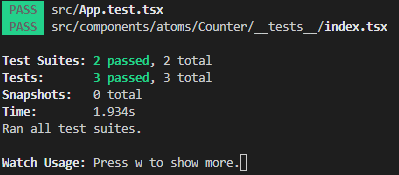

Storybook v5.2 で新しいストーリーのフォーマット・**Component Story Format(CSF)が導入され**、今までの storiesOf から置き換わることが想定されています。今後に備えて簡単に素振りしつつ、その良さについて触れていきます。

実装したリポジトリはこちらです；  
https://github.com/suzukalight/study-storybook-component-story-format

# 速攻で試す

何はなくとも、まずハンズオンしてみるのが良いと思います。下記の手順で試せます；

```bash
$ npx create-react-app study-storybook-component-story-format --typescript
$ cd study-storybook-component-story-format
$ yarn add -D @storybook/react babel-loader @babel/core @babel/plugin-syntax-jsx
```

```javascript{2}:title=/package.json
  "scripts": {
    "storybook": "start-storybook"
  },
```

```javascript:title=/.storybook/config.js
import { configure } from '@storybook/react';

configure(require.context('../src', true, /\.stories\.tsx$/), module);
```

```javascript:title=/src/components/atoms/Button/__stories__/index.stories.tsx
import React from 'react';
import { Button } from '@storybook/react/demo';

export default { title: 'Button' };

export const withText = () => <Button>Hello Button</Button>;

export const withEmoji = () => (
  <Button>
    <span role="img" aria-label="so cool">
      😀 😎 👍 💯
    </span>
  </Button>
);
```

```bash
$ yarn storybook
```

storiesOf API を利用せず、export しているのが特徴ですね。次章で詳しく見ていきます。


# Component Story Format(CSF)概要

- [Component Story Format - Storybook - Medium](https://medium.com/storybookjs/component-story-format-66f4c32366df)
- [Component Story Format (CSF)](https://storybook.js.org/docs/formats/component-story-format/)

## コンセプト

> **ストーリーは、特定の状態のコンポーネントの例をレンダリングするコードスニペットです。**  
> (上記 URL より引用。翻訳: Google 翻訳)

以前の Storybook は、storiesOf でコンポーネントパターンを定義していましたが、storiesOf 形式では当然 Storybook にロックインするため、**せっかく定義した「コンポーネントの状態」を、他ツールへ応用しづらいのが現状です。**

CSF は、Storybook v5.2 で新しく導入されたフォーマットです。**そのコアコンセプトは、この storiesOf にポータビリティを持たせることです**。Jest や Cypress など、他ツールとも連携できるように設計されています。

具体的には、コンポーネントと状態とをまとめた関数（スニペット）として定義します；

```javascript
export const disabled = () => <Counter disabled />;
```

内容の記述自体は、storiesOf のときとさほど変わりませんが、関数であると定義することで、「disabled なボタンをレンダリングする関数」「ユーザ情報が詰まった表をレンダリングする関数」など、**コンポーネントと状態とをセットで扱うことができます。そういう取り回しやすいフォーマットとして再定義した、というのが最大の売りだと感じます。**

## 記述法

CSF は、export に制約を作ることで、情報の取り扱い方を定義しています。具体的には、**default export でストーリーに関する属性を提供し、named export で各ストーリーを 1 つずつ提供する形になっています。**

```javascript
export default {title： 'atoms|Button'};

export const withText =（）=> <Button> Hello </Button>;
export const withEmoji =（）=> <Button>😀😎👍💯</Button>;
```

この例だと Storybook からは、ATOMS カテゴリの Button グループに、**With Text と With Emoji という 2 つのストーリーが定義されているものとして扱われ、Storybook に表示されます。**


上記の例に加えて、属性側に「どの関数をストーリーとして扱ってよいかの指定」などを行うことができます。詳細は [Storybook のドキュメント](https://storybook.js.org/docs/formats/component-story-format/) を参照ください。

# Storybook と react-testing-library で CSF を利用

実際に CSF を作ってみて、それを複数の環境から使用してみましょう。

具体例として、カウンタコンポーネントとその CSF を作成して、それを Storybook と react-testing-library でのテストの双方で使用する例を作成します。


カウンタコンポーネントには、**props として button へ disabled を与えることができるようにします**。これを状態のパターンとして、Storybook ではレンダリングし、react-testing-library では実行時テストの対象とします。

**Counter コンポーネント**

```javascript:title=/src/components/atoms/Counter/index.tsx
import React, { useState } from 'react';

interface CounterProps {
  disabled?: boolean;
}

const Counter = ({ disabled }: CounterProps) => {
  const [count, setCount] = useState(0);

  return (
    <div>
      <p>{count}</p>
      <button disabled={disabled} onClick={() => setCount(count + 1)}>
        increment
      </button>
    </div>
  );
};

export default Counter;
```

**Component Story Format**

```javascript:title=/src/components/atoms/Counter/__stories__/index.stories.tsx
import React from 'react';
import Counter from '..';

export default { title: 'atoms|Counter' };

export const initial = () => <Counter />;

export const disabled = () => <Counter disabled />;
```

**initial と disabled という、2 種類の状態を閉じ込めた Story を定義しました**。この CSF が、Storybook と react-testing-library の両方で使用できるかが、今回検証したいところです。

## Storybook による CSF 利用

`yarn storybook` を実行してみます。期待通り、Storybook が CSF を自動的に認識し、ストーリーとして表示してくれました；


## react-testing-library による CSF 利用

CSF ファイルには、initial/disabled の 2 種類の状態を定義しました。これが正しく挙動するかどうかについては、ボタンクリックイベントを発生させて確認したいところです。react-testing-library で動かしてみましょう。

テストファイルで CSF を import して、enabled/disabled の 2 種類の状態パターンとして利用します。click をボタンに対してトリガして、カウンタ値が期待通りに変化するかについて、テストを書きます；

```javascript:title=/src/components/atoms/Counter/__tests__/index.tsx
import { render, fireEvent } from '@testing-library/react';

import { initial, disabled } from '../__stories__/index.stories';

describe('counter interactivity', () => {
  it('should increment when enabled', () => {
    const comp = render(initial());
    fireEvent.click(comp.getByText('increment'));
    expect(comp.getByText('1')).toBeTruthy();
  });
  it('should do nothing when disabled', () => {
    const comp = render(disabled());
    fireEvent.click(comp.getByText('increment'));
    expect(comp.getByText('0')).toBeTruthy();
  });
});
```

`yarn test` でテストを実行します。無事にテストをパスしました！



# まとめ

**Storybook v5.2 で新登場した Component Story Format は、ストーリー定義を「特定の状態のコンポーネントの例をレンダリングするコードスニペット」として扱うことができる仕組みです。**

コンポーネントと状態をセットにして、関数として export することでポータビリティが大幅に向上し、Storybook だけではなく、テストやドキュメントなどにも、コンポーネントの様々な状態を提供できるようになります。

それを今回、具体例として、カウンタコンポーネントの disabled 状態について CSF で定義し、見た目の挙動については Storybook で、イベントハンドリングの挙動については react-testing-libary で、2 つの側面からテストできることが確認できました。

ストーリーが可搬性を持つことで、**単に Storybook のためだけに書いていたコンポーネントの状態を、様々なツールに応用できる環境が整いました**。対応するツールが増える可能性も高いと思います。期待して素振りを続けます！

# 完成品

実装したリポジトリはこちらです；  
https://github.com/suzukalight/study-storybook-component-story-format
